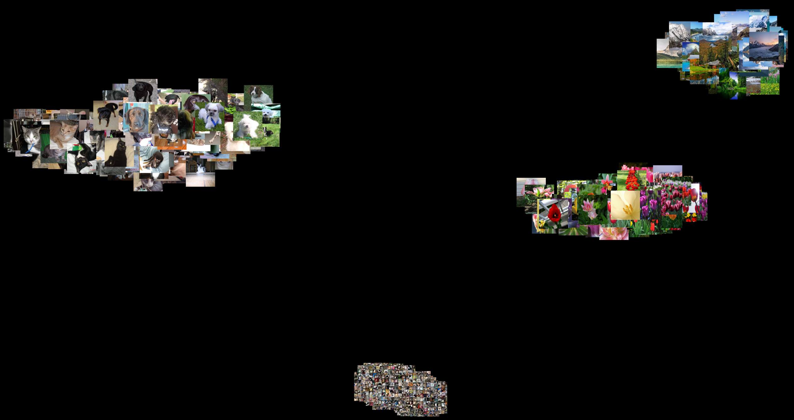

# Image Retrieval Based on Natural Language Embeddings
Retrieval of relevant content from a large collection of samples is a challenging task, especially when the images do not come with additional meta-information or descriptive tags or captions. This repository shows example code based on OpenAIs CLIP-Model to demonstrate, how image retrieval based on natural language can be done without training or fine-tuning a deep neural network to the specific task.

The below gallery shows example of images retrieved from my hard drive after scanning various datasets i have downloaded over the past weeks and months.

Note how some of the images are dupliactes as they appear multiple times on my hard drive. 

## How To used
First, follow the instructions [here](https://github.com/openai/CLIP) and [here](https://github.com/spotify/annoy) to install necessary third-party dependencies. 

In the provided code, add the directories to be scanned on your hard drive here

    c = MultipleIndexer([
          DirectoryIndexer("D:\\python\\", [".png", ".jpg", ".jpeg"]),
        ])

and run the 

    crawl()

function. This will load the CLIP model weights, scan all the directories, calculate embeddings for all images and store them in a database. Note that, depending on the amount of images you process, this can take a very long time (hours to days). This is especially true if you run the model on our CPU rather than a GPU. Make sure to have PyTorch setup to access your GPU. 

Once embeddings are calculated and stored, run the

    query()

method. You will be faced with a prompt to enter your text query. With that query, embeddings are calculated using the CLIP text encoder and matching embeddings will be looked up in the database. Resulting images will be displayed. Type "exit" to quit the program. 

## CLIP (Contrastive Language-Image Pre-Training)
Earlier attempts to learn the relationship between images and its content tried to directly predict the target text (caption) for a given image based on supervised learning. This proves to be very difficult and challenging. A better [approach](https://arxiv.org/pdf/2103.00020.pdf) was shown by A. Radfort et. al from OpenAI in Feb. 2021. They employ *contrastive language-image pre-training* (in short CLIP) where they simulatneously train an image encoder network and a text encoder network with the target to encode matching pairs of text and images with similar embeddings and non-matching pairs with dissimilar embedding vectors. So, given an image and text pair, both encoders output two (in this case) 768-dimensional vectors. For matching pairs (e.g. the text actually describes the content of the image), both vectors shall "point" in the same direction, that is the cosine-similarity between them, namely the dot-product divided by the magnitude of both vectors, is maximized. For non-matching pairs (e.g. an image with a random text description), this dot-product shall be minimized. Both models are pre-trained on a large (web-scraped) data set and made pubically available in their respective [GitHub repository](https://github.com/openai/CLIP). 

## Approximate nearest neighbor look-up
After scanning all images and calculating embedding vectors (signatures) for all images, a huge set of such vectors needs to be stored and eventually being searched efficiently. For a given query, the most similar vectors (according to the cosine-similarity) need to be identified and retrieved. Then the respective imags can be loaded and displayed as a result of the query. To do this efficiently, a third-party libray ([Annoy](https://github.com/spotify/annoy)) is being used. The set of vectors is sorted into a binary tree by [random projections](https://en.wikipedia.org/wiki/Locality-sensitive_hashing#Random_projection) to enable an efficient and fast look-up of matches given a text encoding.

# Exploring the latent space
The CLIP Image encoder projects images into a very descriptive latent space. This space is highly compressed and contains a lot of information about the semantics of the image. It makes sense to explore that space to understand how descriptive it actually is. For the below samples i assume the crawler has run (see above) and the ANNOY database is filled with latent signatures of images. If you have not yet crawled your data, run the

    crawl()

function first. 

## Recommendations
In the 
    
    recommender.py 
    
example, a support vector machine is trained to learn a model of the latent space. The user is presented random images from the database and can vote *yes* or *no* for each image, seperating them into two distinct classes. After enough samples are gathered, a support vector machine with an RBF-Kernel is trained to seperate the classes. A SVM is selected as they are known for performing well even with very little samples, which will be the case for the example. 

Once the SVM is trained, it is used to predict new samples. To increase the data set for training, the system alternates between presenting (predicting) positive and negative samples. This adds new sampels to the dataset and improves the overall accuracy of the SVM. 

## Visualising the latent space
Each image is represented by a 768-dimensional signature and visualizing high-dimensional vector spaces is difficult.  
It is, however possible to visualize the latent space by applying a [principal component analysis (PCA)](https://en.wikipedia.org/wiki/Principal_component_analysis) to all or a subset of the vectors. This can reveal the underlying structure in the data. Since the CLIP encoder aims to map similar semantic content to similar vectors and different semantic content to different vectors, there will likely be huge differences in the signatures if images with different content are encoded. 

The PCA projects the data onto directions with maximum variance. To represent the images in a 2D map, one can project all signatures onto the first two principal components and use the resulting projections as coordinates in a 2D plane. The respective images belonging to these signatures can then be drawn at those locations to show their spatial relationship in the latent vector space.

*PCA of the flower-subset* 

In the above image, PCA is only calculated on the embeddings of the flower-subset. One can clearly see that similar subspecies of flowers are mapped into similar regions while different subspecies are mapped further apart from each other. This emphasizes the hidden structure within that subset.  

*PCA on the whole dataset with two distinct clusters* 

When PCA is calculated over the whole dataset, the principal components focus or more general semantic meaning (such as ANIMAL vs. FLOWER) as can be see above (NOTE: The horizontal axis represents the first principial component). Another example can be seen below with four clusters. It is clear how the principal components allow to clearly distinguish 

*PCA on the whole dataset with four distinct clusters* 

When PCA is calculated over the whole dataset, the principal components focus or more general semantic meaning (such as ANIMAL vs. FLOWER) as can be see above (NOTE: The horizontal axis represents the first principial component)